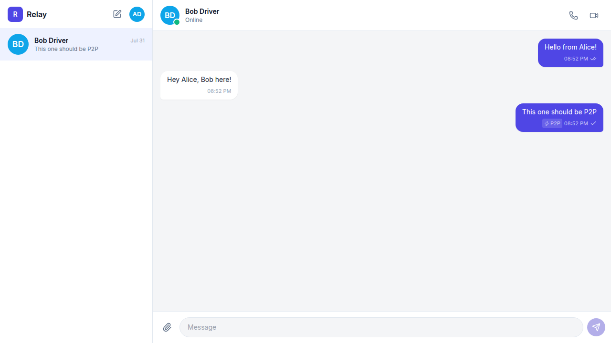
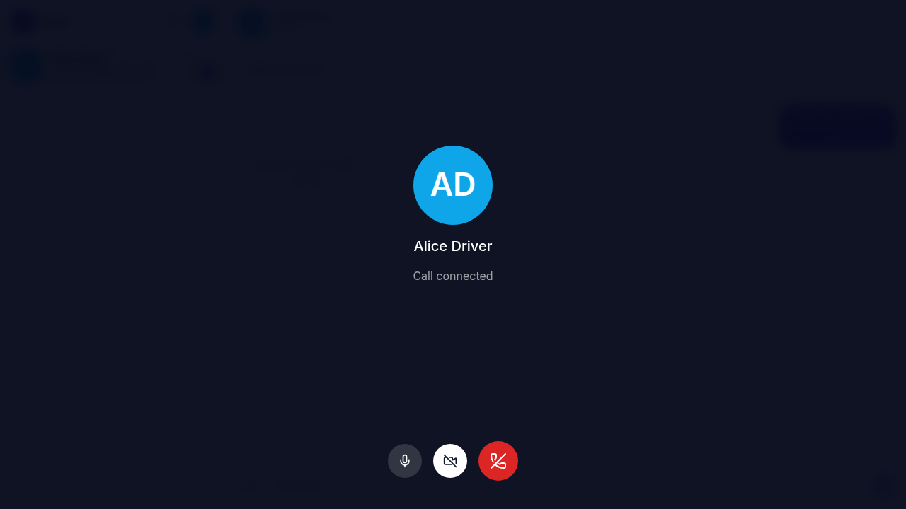

# Relay

A real-time chat app that tries a direct peer-to-peer connection between two people first,
and quietly falls back to always-on server delivery when it can't — plus voice and video
calling over that same connection. Built as an MTech systems project to demonstrate why
real production chat apps combine transport strategies instead of relying on just one.

**Live demo:** https://relay-hybrid-chat-app.vercel.app

<p align="center">
  
  
</p>

## Try the live demo (no signup needed)

The P2P upgrade and calling only kick in once *two people* are in the same chat at the same
time, so testing needs two logged-in sessions. Two demo accounts are seeded for exactly this
— open two browser windows (e.g. a normal window + an incognito window) and log into each:

| Window 1 | Window 2 |
|---|---|
| `demo1@relay.com` / `demo1@123` | `demo2@relay.com` / `demo2@123` |

Start a chat between them, send a message from each side, wait a few seconds for the "⚡ P2P"
badge to appear, then try a voice or video call. (These are throwaway demo accounts with no
real data — please don't use this login for anything else.)

## What makes it "hybrid"

| Path | When it's used | Guarantees |
|---|---|---|
| **Server relay** (FastAPI WebSocket → Redis Pub/Sub → Postgres) | Always | Message history, offline delivery, works even if the other person is offline |
| **Peer-to-peer** (native WebRTC `RTCPeerConnection`) | Automatically, once both people have the chat open at the same time | Lower latency, messages/calls never touch the server |

Every message is persisted via the server path regardless of which path delivered it first —
see `ARCHITECTURE.md` for the full walkthrough of the send logic and the call signaling flow.

## Features

- JWT auth (signup/login), 1:1 direct messaging
- Real-time delivery via FastAPI WebSockets + Redis Pub/Sub fan-out (horizontally-scalable
  by design — see `ARCHITECTURE.md`)
- Automatic peer-to-peer upgrade for text once both people are online, with a visual
  indicator per message showing whether it went P2P or via the server
- Voice **and video** calling — native WebRTC, signaled over the same connection used for
  chat, no third-party calling service — with ringback/ringtone sounds and a live
  speaking-indicator waveform during audio-only calls
- End-to-end encryption — message content is encrypted client-side (ECDH + AES-GCM, native
  Web Crypto API), so the server only ever stores/relays ciphertext
- Typing indicators, read receipts, online/offline presence
- Image/file sharing, paginated message history, rate limiting
- WebSocket reconnect with backoff, so a network blip doesn't kill the chat session

## Tech stack

**Backend:** FastAPI, async SQLAlchemy (Postgres in prod / SQLite locally), Redis Pub/Sub
(real Redis in prod / an in-process `fakeredis` locally — zero external services needed for
development), JWT auth, Alembic migrations.

**Frontend:** React + Vite + Tailwind CSS, native WebRTC (`RTCPeerConnection`), no calling or
signaling library — the same FastAPI WebSocket relay used for chat also carries the WebRTC
handshake.

## Getting started

```bash
# backend
cd backend
python -m venv venv && source venv/bin/activate
pip install -r requirements.txt
cp .env.example .env          # zero-infra defaults: SQLite + in-process fake Redis
alembic upgrade head
uvicorn app.main:app --reload --port 8001

# frontend (separate terminal)
cd frontend
npm install
cp .env.example .env
npm run dev
```

Open `http://localhost:5173`, sign up two accounts, and start chatting. See
`backend/README.md` and `frontend/README.md` for details, and `DEPLOY.md` /
`DEPLOY_ORACLE.md` for testing the full Docker/Postgres/Redis stack locally and deploying.

## Project docs

- [`ARCHITECTURE.md`](ARCHITECTURE.md) — how the hybrid send path and call signaling actually work
- [`PROVENANCE.md`](PROVENANCE.md) — what was adapted from reference projects vs. built from scratch
- [`DEPLOY.md`](DEPLOY.md) — local Docker testing + Railway deployment steps
- [`DEPLOY_ORACLE.md`](DEPLOY_ORACLE.md) — deploying for free, permanently, on Oracle Cloud's Always Free tier (requires a card for identity verification, never billed)
- [`DEPLOY_RENDER.md`](DEPLOY_RENDER.md) — deploying with **no credit card at all**, via Render + Neon + Upstash + Vercel
- [`INTERVIEW_GUIDE.md`](INTERVIEW_GUIDE.md) — how to talk about this project in an interview: what's genuinely different, how each feature is implemented, and real bugs hit while building it

## Known limitations

- P2P chat and calling are scoped to 1:1 conversations (no group mesh/calling)
- No TURN server — two peers both behind restrictive NATs may fail to connect directly
  (chat still works via the server relay either way; there's no fallback for calls)
- Presence tracking is per-process in-memory, correct for a single backend instance; message
  fan-out itself already goes through Redis and is multi-instance-ready
- End-to-end encryption uses trust-on-first-use key distribution (no out-of-band key
  verification) and is single-device (a new browser/login generates a new keypair) — see
  `ARCHITECTURE.md` for the full write-up

## License

[MIT](LICENSE)
